# Diagrama UML - Sistema de Correção Automática

> Gerado automaticamente em 13/07/2025 às 20:37:13

## Visão Geral

Este diagrama representa a arquitetura e relacionamentos entre as classes do sistema de correção automática de assignments.

**Estatísticas:**
- **Total de classes:** 27
- **Módulos:** 15
- **Pacotes:** 4
- **Heranças:** 0
- **Composições:** 3
- **Dependências:** 37

## Diagrama de Classes

```mermaid
classDiagram
    namespace domain {
        class Assignment
        class AssignmentTestExecution
        class AssignmentTestResult
        class AssignmentType
        class CodeAnalysis
        class CorrectionReport
        class GroupSubmission
        class HTMLAnalysis
        class IndividualSubmission
        class PythonExecutionResult
        class SubmissionType
        class ThumbnailResult
        class Turma
    }
    namespace repositories {
        class AssignmentRepository
        class SubmissionRepository
    }
    namespace services {
        class AIAnalyzer
        class CSVExportService
        class CorrectionService
        class HTMLThumbnailService
        class InteractiveExecutionService
        class PromptManager
        class PytestExecutor
        class PythonExecutionService
        class PythonExecutionVisualService
        class StreamlitThumbnailService
    }
    namespace utils {
        class ReportGenerator
        class VisualReportGenerator
    }
    AssignmentTestExecution --> AssignmentTestResult : has-a
    Assignment --> AssignmentType : has-a
    Assignment --> SubmissionType : has-a
    CorrectionReport ..> CorrectionReport
    AssignmentRepository ..> AssignmentType
    AssignmentRepository ..> SubmissionType
    AssignmentRepository ..> Assignment
    SubmissionRepository ..> GroupSubmission
    SubmissionRepository ..> Turma
    SubmissionRepository ..> IndividualSubmission
    SubmissionRepository ..> SubmissionType
    AIAnalyzer ..> PromptManager
    AIAnalyzer ..> CodeAnalysis
    AIAnalyzer ..> Assignment
    AIAnalyzer ..> HTMLAnalysis
    CorrectionService ..> PytestExecutor
    CorrectionService ..> AssignmentTestResult
    CorrectionService ..> HTMLThumbnailService
    CorrectionService ..> AIAnalyzer
    CorrectionService ..> StreamlitThumbnailService
    CorrectionService ..> PythonExecutionService
    CorrectionService ..> SubmissionRepository
    CorrectionService ..> AssignmentRepository
    CorrectionService ..> InteractiveExecutionService
    CorrectionService ..> AssignmentType
    CorrectionService ..> CorrectionReport
    CorrectionService ..> Assignment
    CSVExportService ..> CorrectionReport
    CSVExportService ..> IndividualSubmission
    HTMLThumbnailService ..> ThumbnailResult
    InteractiveExecutionService ..> PythonExecutionResult
    PromptManager ..> Assignment
    PythonExecutionService ..> PythonExecutionResult
    StreamlitThumbnailService ..> ThumbnailResult
    PytestExecutor ..> AssignmentTestExecution
    PytestExecutor ..> AssignmentTestResult
    ReportGenerator ..> CorrectionReport
    ReportGenerator ..> IndividualSubmission
    VisualReportGenerator ..> ThumbnailResult
    VisualReportGenerator ..> CorrectionReport
```

## Estrutura por Pacote

| Pacote | Classes | Quantidade |
|--------|---------|------------|
| `domain` | Assignment, AssignmentTestExecution, AssignmentTestResult, AssignmentType, CodeAnalysis, CorrectionReport, GroupSubmission, HTMLAnalysis, IndividualSubmission, PythonExecutionResult, SubmissionType, ThumbnailResult, Turma | 13 |
| `repositories` | AssignmentRepository, SubmissionRepository | 2 |
| `services` | AIAnalyzer, CSVExportService, CorrectionService, HTMLThumbnailService, InteractiveExecutionService, PromptManager, PytestExecutor, PythonExecutionService, PythonExecutionVisualService, StreamlitThumbnailService | 10 |
| `utils` | ReportGenerator, VisualReportGenerator | 2 |

## Estrutura por Módulo

| Módulo | Classes | Quantidade |
|--------|---------|------------|
| `domain/models.py` | Assignment, AssignmentTestExecution, AssignmentTestResult, AssignmentType, CodeAnalysis, CorrectionReport, GroupSubmission, HTMLAnalysis, IndividualSubmission, PythonExecutionResult, SubmissionType, ThumbnailResult, Turma | 13 |
| `repositories/assignment_repository.py` | AssignmentRepository | 1 |
| `repositories/submission_repository.py` | SubmissionRepository | 1 |
| `services/ai_analyzer.py` | AIAnalyzer | 1 |
| `services/correction_service.py` | CorrectionService | 1 |
| `services/csv_export_service.py` | CSVExportService | 1 |
| `services/html_thumbnail_service.py` | HTMLThumbnailService | 1 |
| `services/interactive_execution_service.py` | InteractiveExecutionService | 1 |
| `services/prompt_manager.py` | PromptManager | 1 |
| `services/python_execution_service.py` | PythonExecutionService | 1 |
| `services/python_execution_visual_service.py` | PythonExecutionVisualService | 1 |
| `services/streamlit_thumbnail_service.py` | StreamlitThumbnailService | 1 |
| `services/test_executor.py` | PytestExecutor | 1 |
| `utils/report_generator.py` | ReportGenerator | 1 |
| `utils/visual_report_generator.py` | VisualReportGenerator | 1 |

## Detalhes dos Relacionamentos

### Herança
- Nenhuma herança encontrada

### Composição
- `AssignmentTestExecution` contém `AssignmentTestResult`
- `Assignment` contém `AssignmentType`
- `Assignment` contém `SubmissionType`

### Dependências
- `CorrectionReport` depende de `CorrectionReport`
- `AssignmentRepository` depende de `AssignmentType`
- `AssignmentRepository` depende de `SubmissionType`
- `AssignmentRepository` depende de `Assignment`
- `SubmissionRepository` depende de `GroupSubmission`
- `SubmissionRepository` depende de `Turma`
- `SubmissionRepository` depende de `IndividualSubmission`
- `SubmissionRepository` depende de `SubmissionType`
- `AIAnalyzer` depende de `PromptManager`
- `AIAnalyzer` depende de `CodeAnalysis`
- `AIAnalyzer` depende de `Assignment`
- `AIAnalyzer` depende de `HTMLAnalysis`
- `CorrectionService` depende de `PytestExecutor`
- `CorrectionService` depende de `AssignmentTestResult`
- `CorrectionService` depende de `HTMLThumbnailService`
- `CorrectionService` depende de `AIAnalyzer`
- `CorrectionService` depende de `StreamlitThumbnailService`
- `CorrectionService` depende de `PythonExecutionService`
- `CorrectionService` depende de `SubmissionRepository`
- `CorrectionService` depende de `AssignmentRepository`
- `CorrectionService` depende de `InteractiveExecutionService`
- `CorrectionService` depende de `AssignmentType`
- `CorrectionService` depende de `CorrectionReport`
- `CorrectionService` depende de `Assignment`
- `CSVExportService` depende de `CorrectionReport`
- `CSVExportService` depende de `IndividualSubmission`
- `HTMLThumbnailService` depende de `ThumbnailResult`
- `InteractiveExecutionService` depende de `PythonExecutionResult`
- `PromptManager` depende de `Assignment`
- `PythonExecutionService` depende de `PythonExecutionResult`
- `StreamlitThumbnailService` depende de `ThumbnailResult`
- `PytestExecutor` depende de `AssignmentTestExecution`
- `PytestExecutor` depende de `AssignmentTestResult`
- `ReportGenerator` depende de `CorrectionReport`
- `ReportGenerator` depende de `IndividualSubmission`
- `VisualReportGenerator` depende de `ThumbnailResult`
- `VisualReportGenerator` depende de `CorrectionReport`

## Legenda do Diagrama

- **<|--** : Herança (is-a)
- **-->** : Composição (has-a)
- **..>** : Dependência (depends-on)
- **package** : Agrupamento de classes por pacote/módulo

## Como Visualizar

1. **GitHub**: Este arquivo Markdown será renderizado automaticamente com o diagrama Mermaid
2. **VS Code**: Use a extensão "Markdown Preview Mermaid Support"
3. **Online**: Cole o conteúdo do bloco Mermaid em https://mermaid.live/

## Gerado por

Script: `tools/generate_mermaid_uml.py`
