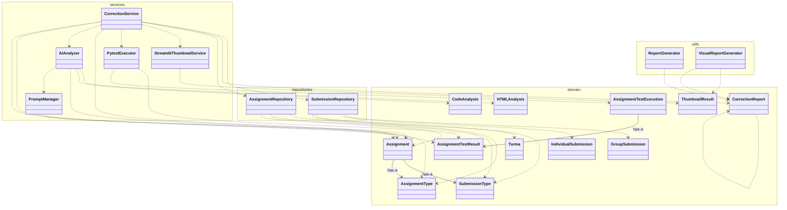

# Diagrama UML - Sistema de Correção Automática

> Gerado automaticamente em 03/07/2025 às 11:00:45

## Visão Geral

Este diagrama representa a arquitetura e relacionamentos entre as classes do sistema de correção automática de assignments.

**Estatísticas:**
- **Total de classes:** 21
- **Módulos:** 10
- **Pacotes:** 4
- **Heranças:** 0
- **Composições:** 3
- **Dependências:** 28

## Diagrama de Classes

## Estrutura por Pacote

| Pacote | Classes | Quantidade |
|--------|---------|------------|
| `domain` | Assignment, AssignmentTestExecution, AssignmentTestResult, AssignmentType, CodeAnalysis, CorrectionReport, GroupSubmission, HTMLAnalysis, IndividualSubmission, SubmissionType, ThumbnailResult, Turma | 12 |
| `repositories` | AssignmentRepository, SubmissionRepository | 2 |
| `services` | AIAnalyzer, CorrectionService, PromptManager, PytestExecutor, StreamlitThumbnailService | 5 |
| `utils` | ReportGenerator, VisualReportGenerator | 2 |

## Estrutura por Módulo

| Módulo | Classes | Quantidade |
|--------|---------|------------|
| `domain/models.py` | Assignment, AssignmentTestExecution, AssignmentTestResult, AssignmentType, CodeAnalysis, CorrectionReport, GroupSubmission, HTMLAnalysis, IndividualSubmission, SubmissionType, ThumbnailResult, Turma | 12 |
| `repositories/assignment_repository.py` | AssignmentRepository | 1 |
| `repositories/submission_repository.py` | SubmissionRepository | 1 |
| `services/ai_analyzer.py` | AIAnalyzer | 1 |
| `services/correction_service.py` | CorrectionService | 1 |
| `services/prompt_manager.py` | PromptManager | 1 |
| `services/streamlit_thumbnail_service.py` | StreamlitThumbnailService | 1 |
| `services/test_executor.py` | PytestExecutor | 1 |
| `utils/report_generator.py` | ReportGenerator | 1 |
| `utils/visual_report_generator.py` | VisualReportGenerator | 1 |

## Detalhes dos Relacionamentos

### Herança
- Nenhuma herança encontrada

### Composição
- `AssignmentTestExecution` contém `AssignmentTestResult`
- `Assignment` contém `SubmissionType`
- `Assignment` contém `AssignmentType`

### Dependências
- `CorrectionReport` depende de `CorrectionReport`
- `AssignmentRepository` depende de `AssignmentType`
- `AssignmentRepository` depende de `SubmissionType`
- `AssignmentRepository` depende de `Assignment`
- `SubmissionRepository` depende de `GroupSubmission`
- `SubmissionRepository` depende de `IndividualSubmission`
- `SubmissionRepository` depende de `SubmissionType`
- `SubmissionRepository` depende de `Turma`
- `AIAnalyzer` depende de `HTMLAnalysis`
- `AIAnalyzer` depende de `CodeAnalysis`
- `AIAnalyzer` depende de `Assignment`
- `AIAnalyzer` depende de `PromptManager`
- `CorrectionService` depende de `SubmissionRepository`
- `CorrectionService` depende de `CorrectionReport`
- `CorrectionService` depende de `AssignmentRepository`
- `CorrectionService` depende de `StreamlitThumbnailService`
- `CorrectionService` depende de `PytestExecutor`
- `CorrectionService` depende de `AssignmentType`
- `CorrectionService` depende de `AIAnalyzer`
- `CorrectionService` depende de `Assignment`
- `CorrectionService` depende de `AssignmentTestResult`
- `PromptManager` depende de `Assignment`
- `StreamlitThumbnailService` depende de `ThumbnailResult`
- `PytestExecutor` depende de `AssignmentTestResult`
- `PytestExecutor` depende de `AssignmentTestExecution`
- `ReportGenerator` depende de `CorrectionReport`
- `VisualReportGenerator` depende de `ThumbnailResult`
- `VisualReportGenerator` depende de `CorrectionReport`

## Legenda do Diagrama

- **<|--** : Herança (is-a)
- **-->** : Composição (has-a)
- **..>** : Dependência (depends-on)
- **package** : Agrupamento de classes por pacote/módulo

## Como Visualizar

1. **GitHub**: Este arquivo Markdown será renderizado automaticamente com o diagrama Mermaid
2. **VS Code**: Use a extensão "Markdown Preview Mermaid Support"
3. **Online**: Cole o conteúdo do bloco Mermaid em https://mermaid.live/

## Gerado por

Script: `tools/generate_mermaid_uml.py`
