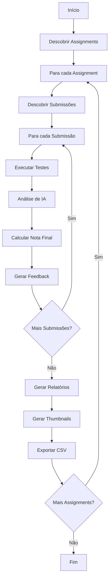
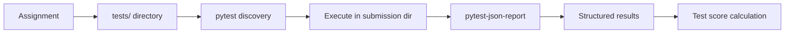
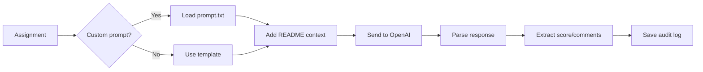

# Arquitetura do Sistema

Este documento descreve a arquitetura técnica do sistema de correção automática.

## Visão Geral

O sistema segue uma arquitetura em camadas (Clean Architecture) com separação clara de responsabilidades:

```
src/
├── domain/           # Camada de domínio (entidades e regras de negócio)
├── repositories/     # Camada de acesso a dados
├── services/         # Camada de serviços (lógica de aplicação)
├── utils/            # Utilitários e helpers
└── main.py          # Ponto de entrada (CLI)
```

## Camadas da Arquitetura

### Services Layer (`src/services/`)

Serviços de aplicação que coordenam a lógica de negócio:

- **`correction_service.py`** - Serviço principal de orquestração
  - Coordena execução de testes e análise de IA
  - Calcula notas finais
  - Gera feedback para alunos

- **`ai_analyzer.py`** - Integração com OpenAI GPT
  - Análise qualitativa de código
  - Prompts personalizados por assignment
  - Parsing estruturado de respostas

- **`test_executor.py`** - Execução de testes com pytest
  - Usa pytest-json-report para resultados estruturados
  - Execução direta nas pastas dos alunos
  - Timeouts configuráveis

- **`prompt_manager.py`** - Gerenciamento de prompts de IA
  - Prompts personalizados por assignment
  - Templates padrão para Python e HTML
  - Integração com README.md dos assignments

- **`streamlit_thumbnail_service.py`** - Screenshots de dashboards Streamlit
  - Selenium + Chrome para captura
  - Gerenciamento de portas e processos
  - Instalação automática de dependências

- **`html_thumbnail_service.py`** - Screenshots de páginas HTML
  - Captura direta de arquivos HTML estáticos
  - Selenium para renderização

- **`python_execution_service.py`** - Execução de código Python
  - Captura de STDOUT e STDERR
  - Timeouts e tratamento de erros

- **`interactive_execution_service.py`** - Assignments interativos
  - Suporte a argumentos de linha de comando
  - Simulação de inputs do usuário

- **`csv_export_service.py`** - Exportação para CSV
  - Formato compatível com Excel e BI
  - Encoding UTF-8

### Domain Layer (`src/domain/`)

Modelos de domínio e regras de negócio:

- **`models.py`** - Entidades do domínio
  - `SubmissionType` (INDIVIDUAL/GROUP)
  - `AssignmentTestResult`
  - `CodeAnalysis`, `HTMLAnalysis`
  - `CorrectionReport`

### Repositories (`src/repositories/`)

Acesso e manipulação de dados:

- **`assignment_repository.py`** - Gerenciamento de assignments
  - Leitura de enunciados
  - Descoberta de testes
  - Configurações por assignment

- **`submission_repository.py`** - Gerenciamento de submissões
  - Descoberta de submissões (individual/grupo)
  - Acesso a arquivos dos alunos

### Utils (`src/utils/`)

Utilitários e geradores:

- **`report_generator.py`** - Geração de relatórios
  - Múltiplos formatos (HTML, Markdown, JSON, Console)
  - Templates responsivos
  - Estatísticas e gráficos

- **`visual_report_generator.py`** - Relatórios visuais
  - Organização por nota
  - Integração com thumbnails
  - Interface HTML interativa

## Fluxo de Execução

### Processamento Completo (correct-all-with-visual)



### Sistema de Testes



### Sistema de IA



## Sistema de Cálculo de Notas

Para detalhes completos sobre o cálculo de notas, consulte [Sistema de Cálculo de Notas](sistema-notas.md).

### Fórmula para Assignments Python

```
Nota Final = (Nota dos Testes × 0.4) + (Nota da IA × 0.6)
```

### Fórmula para Assignments HTML

```
Nota Final = Nota da IA (100%)
```

## Sistema de Prompts

### Hierarquia de Prompts

1. **Prompt personalizado**: `prompts/{assignment-name}/prompt.txt` (versionado)
2. **Template padrão**: Python ou HTML template
3. **Instruções especiais**: Para assignments de scraping

### Variáveis Disponíveis

- `{assignment_name}` - Nome do assignment
- `{assignment_description}` - Descrição do README.md
- `{assignment_requirements}` - Lista de requisitos
- `{student_code}` - Código do aluno formatado

## Sistema de Logs de Auditoria

### Estrutura

```
logs/
├── YYYY-MM-DD/
│   └── assignment-name/
│       └── submission_analysis_timestamp.json
```

### Conteúdo dos Logs

```json
{
  "metadata": {
    "assignment_name": "prog1-prova-av",
    "submission_identifier": "joao-silva",
    "analysis_type": "python",
    "timestamp": "2025-01-15T10:30:14.095265",
    "ai_model": "gpt-3.5-turbo"
  },
  "prompt": "...",
  "raw_response": "...",
  "parsed_result": {...}
}
```

## Performance e Otimizações

### Thumbnails Streamlit

- **Dependências instaladas uma única vez** por execução
- **Processos órfãos removidos** automaticamente (psutil)
- **Altura mínima de 1800px** para captura completa
- **Suporte a alta resolução** (2880x1620, 200% escala)

### Execução de Testes

- **Execução direta** nas pastas dos alunos (sem cópia)
- **Timeouts configuráveis** para evitar travamentos
- **Limitação de output** para performance

### Processamento Paralelo

- Cada submissão Streamlit em porta separada
- Processos independentes para thumbnails
- Limpeza automática de recursos

## Tecnologias Utilizadas

- **Python 3.8+**
- **pytest** + pytest-json-report - Execução de testes
- **OpenAI GPT** - Análise de código
- **Selenium** + Chrome - Screenshots
- **Rich** - Interface CLI colorida
- **Pillow** - Manipulação de imagens
- **psutil** - Gerenciamento de processos
