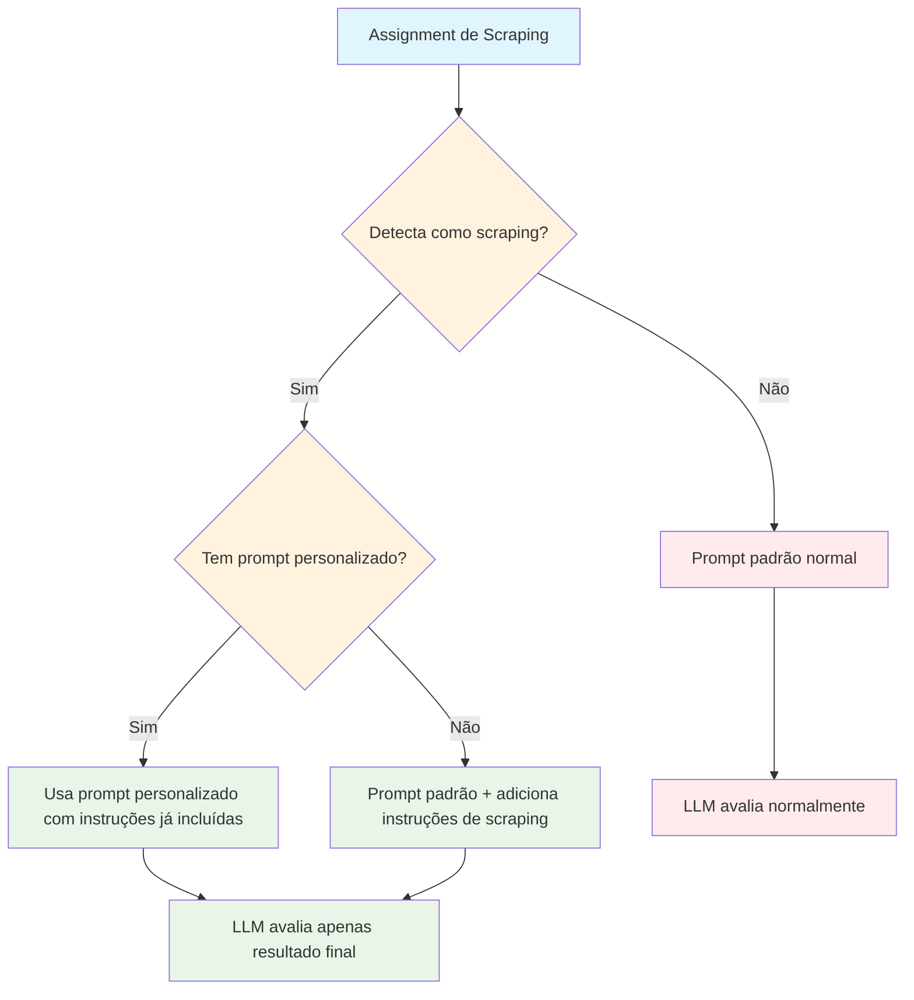

# Solução para Avaliação Incorreta do LLM em Assignments de Scraping

## 📋 Problema Identificado

O LLM estava avaliando incorretamente assignments de scraping ao:

1. **Descontar pontos** quando o aluno usava seletores CSS que funcionavam na página atual, mas que o LLM "achava" que estavam incorretos baseado no seu conhecimento sobre a estrutura da página
2. **Sugerir seletores "corretos"** baseado no conhecimento do LLM sobre como a página "deveria" ser estruturada
3. **Avaliar incorretamente** quando o código funcionava perfeitamente (extraía os dados corretos) mas usava uma abordagem diferente da que o LLM esperava

### Exemplo do Problema

**Cenário**: Aluno extrai corretamente "The Shawshank Redemption (1994) - Nota: 9.3" do IMDB usando classes CSS modernas.

**Avaliação Incorreta do LLM**:
- ❌ "Usa seletores CSS incorretos, deveria usar tabela"
- ❌ "A estrutura HTML não corresponde ao que espero da página"
- ❌ "Deveria usar classes específicas que conheço"

**Resultado**: Nota reduzida mesmo com código funcionando perfeitamente.

## 🎯 Solução Implementada

### 1. **Reforço das Instruções Críticas**

Adicionadas instruções **muito mais proeminentes e repetitivas** nos prompts:

```markdown
🚨 **REGRA ABSOLUTA PARA SCRAPING**: AVALIE APENAS O RESULTADO FINAL, NUNCA O MÉTODO!

⚠️ **PROIBIDO TOTALMENTE**:
- ❌ NÃO avalie se os seletores CSS estão "corretos" ou "incorretos"
- ❌ NÃO critique classes CSS, IDs ou estrutura HTML usados
- ❌ NÃO sugira seletores "melhores" ou "mais apropriados"
- ❌ NÃO avalie se a estrutura HTML corresponde ao que você conhece da página
- ❌ NÃO mencione que "a página deveria ter tabela" ou "deveria usar classes específicas"
- ❌ NÃO desconsidere dados extraídos só porque usou método diferente do esperado
```

### 2. **Critérios de Avaliação Claros**

Definidos critérios específicos para scraping:

```markdown
✅ **O QUE AVALIAR**:
- ✅ O código roda sem erros?
- ✅ Extrai os dados solicitados?
- ✅ Retorna no formato correto?
- ✅ Exibe output no terminal no formato especificado?
- ✅ Passa nos testes automatizados?

📊 **CRITÉRIOS DE NOTA PARA SCRAPING**:
- **NOTA 10**: Código roda + extrai todos os dados + formato correto + passa testes
- **NOTA 8-9**: Código roda + extrai dados (mesmo com pequenos problemas) + formato correto
- **NOTA 6-7**: Código roda + extrai alguns dados + formato parcialmente correto
- **NOTA 4-5**: Código roda mas não extrai dados corretos
- **NOTA 0-3**: Código não roda ou não extrai nada
```

### 3. **Exemplos de Avaliação Correta**

Incluídos exemplos específicos:

```markdown
🎯 **EXEMPLO DE AVALIAÇÃO CORRETA**:
Se o aluno extrai dados corretos e o código roda sem erro:
- ✅ CORRETO: "Extrai dados corretos e código funciona"
- ❌ INCORRETO: "Usa seletores CSS incorretos, deveria usar tabela"
```

## 🔧 Arquivos Modificados

### 1. **Prompts Específicos de Assignment**

- `prompts/prog1-tarefa-scrap-simples/prompt.txt`
- `prompts/prog1-tarefa-scrap-yahoo/prompt.txt`

### 2. **Prompts Padrão do Sistema**

- `src/services/prompt_manager.py` - Métodos `_format_custom_prompt` e `_format_default_prompt`
- `src/services/ai_analyzer.py` - Método `_build_python_analysis_prompt`

## 📊 Resultado Esperado

Com essas modificações, o LLM deve:

1. **Focar apenas nos resultados** de execução e testes
2. **Ignorar completamente** como o aluno implementou o scraping
3. **Avaliar corretamente** códigos que funcionam, independente do método usado
4. **Dar notas justas** baseadas no funcionamento real do código

### Exemplo de Avaliação Correta Esperada

**Cenário**: Aluno extrai corretamente dados do IMDB usando qualquer método que funcione.

**Avaliação Correta do LLM**:
- ✅ "Código roda sem erros e extrai dados corretos"
- ✅ "Formato de saída está correto"
- ✅ "Passa nos testes automatizados"
- ✅ **NOTA: 10** (se todos os requisitos atendidos)

## 🔄 Fluxo de Funcionamento



### **Detalhamento do Fluxo:**

1. **Detecção Automática**: O sistema verifica se é um assignment de scraping baseado em:
   - Lista de assignments conhecidos (`prog1-tarefa-scrap-simples`, `prog1-prova-av`, etc.)
   - Palavras-chave nos requisitos (`scraping`, `requests`, `beautifulsoup`, etc.)

2. **Seleção de Prompt**:
   - **Com prompt personalizado**: Usa o prompt específico que já contém as instruções
   - **Sem prompt personalizado**: Adiciona automaticamente as instruções ao prompt padrão

3. **Avaliação Especializada**:
   - O LLM recebe instruções claras sobre o que NÃO avaliar (seletores CSS, estrutura HTML)
   - Foca apenas no resultado final (dados extraídos, funcionamento, testes)

## 🚀 Aplicação Automática

A solução se aplica automaticamente a:

1. **Assignments com prompts personalizados** - Instruções específicas já incluídas
2. **Assignments sem prompts personalizados** - Instruções incluídas nos prompts padrão
3. **Futuros assignments de scraping** - Basta seguir o padrão estabelecido

## 📝 Manutenção

Para manter a solução eficaz:

1. **Sempre incluir** as instruções específicas para scraping em novos assignments
2. **Monitorar logs** para verificar se o problema foi resolvido
3. **Ajustar instruções** se necessário baseado no feedback dos resultados

## 🎯 Benefícios

- **Avaliações mais justas** para alunos que implementam scraping funcional
- **Foco no resultado** em vez do método
- **Consistência** entre diferentes assignments de scraping
- **Redução de reclamações** sobre avaliações injustas
- **Melhor experiência** para alunos que usam métodos alternativos válidos 